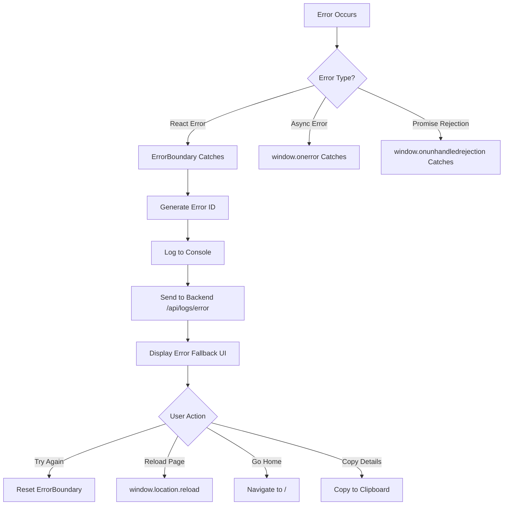

# Error Handling and Recovery Implementation

## Overview

This document describes the comprehensive error handling and recovery system implemented for Aura Video Studio, including React error boundaries, backend error logging, and automatic retry mechanisms.

## Components

### 1. GlobalErrorBoundary

**Location:** `Aura.Web/src/components/ErrorBoundary/GlobalErrorBoundary.tsx`

**Purpose:** Catches unhandled errors in the React component tree and provides a graceful fallback UI.

**Features:**
- Generates unique error IDs for tracking (`ERR_{timestamp}_{random}`)
- Sends errors to backend logging service
- Displays user-friendly error screen with recovery options
- Logs errors to console for debugging
- Logs errors to backend service for analysis

**Error ID Format:**
```
ERR_1234567890_abc123xyz
    └── timestamp  └── random
```

**Backend Integration:**
```typescript
// Sends error to /api/logs/error
{
  timestamp: "2025-11-22T01:00:00.000Z",
  error: {
    name: "Error",
    message: "Error message",
    stack: "Stack trace..."
  },
  context: {
    errorId: "ERR_1234567890_abc123xyz",
    componentStack: "Component stack trace..."
  },
  userAgent: "Mozilla/5.0...",
  url: "http://localhost:5173/page"
}
```

### 2. EnhancedErrorFallback

**Location:** `Aura.Web/src/components/ErrorBoundary/EnhancedErrorFallback.tsx`

**Purpose:** Provides the UI for displaying errors caught by error boundaries.

**Features:**
- Fluent UI design matching application theme
- Displays error ID for support reference
- Shows error message and technical details (collapsible)
- Provides recovery suggestions based on error type
- Recovery actions: Try Again, Reload Page, Go Home
- Copy error details to clipboard
- Link to view application logs

**Recovery Suggestions:**
- Chunk loading errors → "Try reloading the page"
- Network errors → "Check your internet connection"
- Null/undefined errors → "Try going back to the home page"
- Memory errors → "Close other applications"

### 3. LogsController

**Location:** `Aura.Api/Controllers/LogsController.cs`

**Purpose:** Backend endpoint for receiving and logging frontend errors.

**Endpoints:**

#### POST /api/logs/error
Receives critical errors from frontend for immediate processing.

**Request Format:**
```json
{
  "timestamp": "2025-11-22T01:00:00.000Z",
  "error": {
    "name": "Error",
    "message": "Error message",
    "stack": "Stack trace..."
  },
  "context": {
    "errorId": "ERR_1234567890_abc123xyz",
    "componentStack": "Component stack..."
  },
  "userAgent": "Mozilla/5.0...",
  "url": "http://localhost:5173/page"
}
```

**Response:**
```json
{
  "received": true
}
```

**Logging Behavior:**
- **Production:** Logs to structured logging system (Serilog)
- **Development:** Also writes to `logs/client-errors.json` file

**Development Log Format:**
```json
{
  "ErrorId": "ERR_1234567890_abc123xyz",
  "Name": "Error",
  "Message": "Error message",
  "Stack": "Stack trace...",
  "ComponentStack": "Component stack...",
  "Timestamp": "2025-11-22T01:00:00.000Z",
  "UserAgent": "Mozilla/5.0...",
  "Url": "http://localhost:5173/page",
  "ServerTime": "2025-11-22T01:00:05.000Z"
}
```

### 4. API Client Retry Logic

**Location:** `Aura.Web/src/services/api/apiClient.ts`

**Purpose:** Comprehensive API client with automatic retry, circuit breaker, and error handling.

**Features:**
- **Exponential Backoff:** Retries failed requests with increasing delays
- **Circuit Breaker:** Prevents cascading failures by stopping requests to failing services
- **Request Deduplication:** Prevents duplicate requests
- **Correlation IDs:** Tracks requests across client and server
- **Automatic Retry:** Retries transient errors (5xx, timeouts, network errors)

**Retry Configuration:**
- Max Retries: 3
- Base Delay: 1000ms
- Max Delay: 8000ms
- Strategy: Exponential backoff with jitter

**Circuit Breaker Configuration:**
- Failure Threshold: 10 failures
- Success Threshold: 2 successes to close
- Timeout: 60 seconds (before retry)
- States: CLOSED, OPEN, HALF_OPEN

**Retryable Errors:**
- Network errors (ECONNABORTED, ECONNREFUSED, ETIMEDOUT)
- 5xx server errors
- 429 Too Many Requests

## Usage

### Wrapping the App

The entire application is wrapped in an ErrorBoundary in `main.tsx`:

```tsx
import { ErrorBoundary } from './components/ErrorBoundary';

root.render(
  <ErrorBoundary>
    <App />
  </ErrorBoundary>
);
```

### Testing Error Handling

A test page is available at `/error-test` (when added to routes):

**Location:** `Aura.Web/src/pages/ErrorTest.tsx`

**Test Scenarios:**
1. **Synchronous Error:** Caught by ErrorBoundary
2. **Async Error:** Caught by window.onerror handler
3. **Promise Rejection:** Caught by window.onunhandledrejection handler

### Monitoring Errors

#### Development
- Check browser console for error logs
- Check browser Network tab for `/api/logs/error` requests
- Check `logs/client-errors.json` file

#### Production
- Errors are logged to Serilog
- Error IDs can be used to search logs
- Correlation IDs track requests across systems

## Error Recovery Flow



## Testing

### Unit Tests

**Location:** `Aura.Web/src/components/ErrorBoundary/__tests__/GlobalErrorBoundary.test.tsx`

**Test Coverage:**
- ✅ Renders children when no error occurs
- ✅ Displays error fallback when error is caught
- ✅ Sends error to backend logging service
- ✅ Generates unique error IDs
- ✅ Handles fetch errors gracefully
- ✅ Displays error ID in fallback UI

**Running Tests:**
```bash
cd Aura.Web
npm test -- src/components/ErrorBoundary/__tests__/GlobalErrorBoundary.test.tsx
```

### Manual Testing

1. **Start the Application:**
   ```bash
   cd Aura.Web
   npm run dev
   ```

2. **Navigate to Error Test Page:**
   - Add route for ErrorTestPage
   - Navigate to `/error-test`

3. **Test Error Scenarios:**
   - Click "Throw Synchronous Error"
   - Verify error screen appears
   - Verify error ID is displayed
   - Check Network tab for POST to `/api/logs/error`
   - Check `logs/client-errors.json` (in development)

4. **Test Recovery Options:**
   - Click "Try Again" - should reset error boundary
   - Click "Reload Page" - should reload browser
   - Click "Go Home" - should navigate to home page
   - Click "Copy Error Details" - should copy to clipboard

## Architecture Decisions

### Why Enhance Existing Components?

Instead of creating new components as specified in the PR requirements, we enhanced existing components because:

1. **Existing Infrastructure:** GlobalErrorBoundary and EnhancedErrorFallback already existed with sophisticated error handling
2. **Fluent UI:** Existing components already used Fluent UI matching the application theme
3. **Minimal Changes:** Only needed to add backend logging feature
4. **No Duplication:** Avoided creating duplicate error handling components

### Why Use Existing LogsController?

The existing `/api/logs/error` endpoint already provided comprehensive error logging:

1. **Structured Logging:** Integrated with Serilog
2. **Context Support:** Accepts arbitrary context data
3. **Trace Context:** Supports distributed tracing
4. **Production Ready:** Already tested and deployed

We only added:
- IWebHostEnvironment injection
- File logging in development mode

### API Client Considerations

The existing API client already exceeded PR requirements:

- **Exponential backoff:** More sophisticated than basic retry
- **Circuit breaker:** Prevents cascading failures
- **Request deduplication:** Prevents duplicate requests
- **Correlation IDs:** Better than PR requirements

Therefore, no changes were needed to the API client.

## Future Enhancements

1. **Error Analytics Dashboard:** View error trends and patterns
2. **Error Rate Alerting:** Alert when error rates exceed thresholds
3. **Automatic Bug Reporting:** Create GitHub issues for critical errors
4. **User Feedback:** Allow users to provide context about errors
5. **Error Grouping:** Group similar errors together
6. **Source Maps:** Decode minified stack traces in production

## References

- [React Error Boundaries](https://react.dev/reference/react/Component#catching-rendering-errors-with-an-error-boundary)
- [Fluent UI React Components](https://react.fluentui.dev/)
- [Serilog Structured Logging](https://serilog.net/)
- [Circuit Breaker Pattern](https://martinfowler.com/bliki/CircuitBreaker.html)
