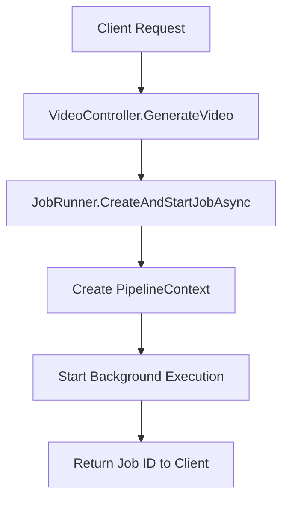
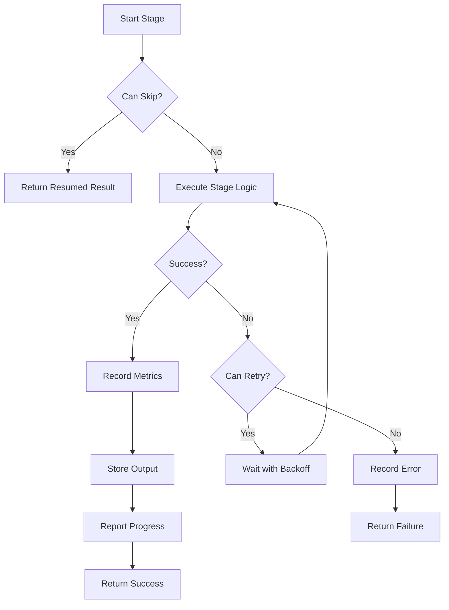
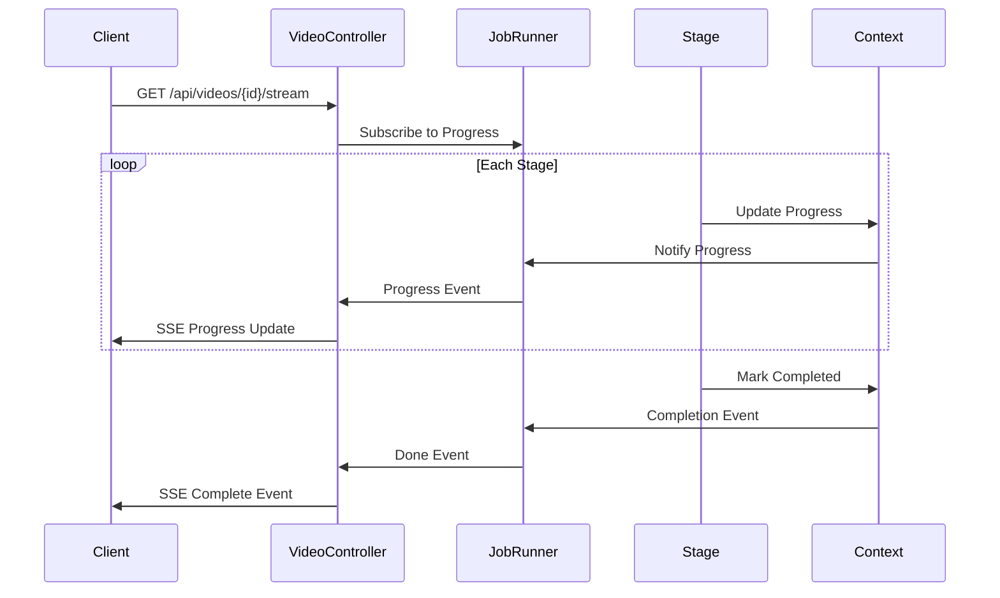

# Video Generation Pipeline Architecture

## Overview

The Aura Video Studio video generation pipeline is a stage-based orchestration system that transforms a brief into a complete video through a series of well-defined stages. The pipeline is designed for:

- **Reliability**: Automatic retry logic, circuit breakers, and graceful degradation
- **Observability**: Comprehensive logging, metrics, and progress tracking
- **Resumability**: Checkpoint/resume support for long-running jobs
- **Extensibility**: Easy to add new stages or customize existing ones

## Pipeline Stages

The video generation process consists of 5 sequential stages:

### 1. Brief Stage
**Purpose**: Validate and preprocess the input brief

**Responsibilities**:
- Validate brief content (topic, audience, goal)
- Check system resources (FFmpeg, disk space, memory)
- Prepare brief for downstream stages

**Output**: `BriefStageOutput`
- Validated brief object
- Validation results
- Processing timestamp

**Typical Duration**: < 5 seconds

### 2. Script Stage
**Purpose**: Generate video script using LLM

**Responsibilities**:
- Call LLM provider to generate script from brief
- Validate script structure (scenes, narration)
- Validate script quality (coherence, length)
- Support RAG (Retrieval Augmented Generation) if enabled

**Output**: `ScriptStageOutput`
- Generated script text
- Character count
- Provider information
- Generation timestamp

**Typical Duration**: 10-30 seconds

### 3. Voice Stage
**Purpose**: Convert script to audio narration

**Responsibilities**:
- Parse script into scenes and script lines
- Call TTS provider to synthesize audio
- Validate audio quality (duration, format)
- Calculate scene timings

**Output**: `VoiceStageOutput`
- Path to narration audio file
- Scene count and timing information
- TTS provider and voice details

**Typical Duration**: 20-60 seconds

### 4. Visuals Stage
**Purpose**: Generate or fetch visual assets for each scene

**Responsibilities**:
- Generate images for each scene (if image provider available)
- Validate image quality and format
- Handle missing assets gracefully
- Register assets for cleanup

**Output**: `VisualsStageOutput`
- Dictionary of scene assets (indexed by scene)
- Asset generation statistics
- Provider information

**Typical Duration**: 30-90 seconds (highly variable)

**Note**: This stage is optional and will gracefully skip if no image provider is configured.

### 5. Composition Stage
**Purpose**: Combine all assets into final video

**Responsibilities**:
- Build timeline from scenes, narration, and assets
- Call video composer (FFmpeg) to render
- Validate output video
- Report final video metadata

**Output**: `CompositionStageOutput`
- Path to final video file
- Video metadata (resolution, codec, duration)
- File size

**Typical Duration**: 30-120 seconds

## Architecture Components

### PipelineStage Base Class

The `PipelineStage` abstract class provides common functionality for all stages:

```csharp
public abstract class PipelineStage
{
    // Stage identification
    public abstract string StageName { get; }
    public abstract string DisplayName { get; }
    
    // Configuration
    public virtual int ProgressWeight => 20;
    public virtual TimeSpan Timeout => TimeSpan.FromMinutes(5);
    public virtual bool SupportsRetry => true;
    public virtual int MaxRetryAttempts => 3;
    
    // Execution
    public Task<PipelineStageResult> ExecuteAsync(
        PipelineContext context,
        IProgress<StageProgress>? progress,
        CancellationToken ct);
    
    // Abstract method for derived classes
    protected abstract Task ExecuteStageAsync(
        PipelineContext context,
        IProgress<StageProgress>? progress,
        CancellationToken ct);
}
```

**Key Features**:
- Automatic retry logic with exponential backoff
- Progress reporting
- Error tracking and metrics collection
- Resume/skip support
- Timeout handling
- Cancellation support

### PipelineContext

The `PipelineContext` class maintains state across stages:

```csharp
public sealed class PipelineContext : IDisposable
{
    // Input specifications
    public string CorrelationId { get; }
    public Brief Brief { get; }
    public PlanSpec PlanSpec { get; }
    public VoiceSpec VoiceSpec { get; }
    public RenderSpec RenderSpec { get; }
    public SystemProfile SystemProfile { get; }
    
    // Pipeline state
    public PipelineState State { get; set; }
    public string CurrentStage { get; set; }
    
    // Stage outputs
    public string? GeneratedScript { get; set; }
    public List<Scene>? ParsedScenes { get; set; }
    public string? NarrationPath { get; set; }
    public Dictionary<int, IReadOnlyList<Asset>> SceneAssets { get; set; }
    public string? FinalVideoPath { get; set; }
    
    // Methods
    public void SetStageOutput<T>(string stageName, T output);
    public T? GetStageOutput<T>(string stageName);
    public void RecordStageMetrics(string stageName, PipelineStageMetrics metrics);
    public void RecordError(string stageName, Exception exception, bool isRecoverable);
}
```

**Key Features**:
- Thread-safe stage output storage
- Metrics and error tracking
- Memory-efficient channels for streaming
- Checkpoint support

### OrchestratorOptions

Configuration options for customizing pipeline behavior:

```csharp
public class OrchestratorOptions
{
    public bool EnableCheckpoints { get; set; } = true;
    public bool EnableMetrics { get; set; } = true;
    public int MaxRetryAttempts { get; set; } = 3;
    public TimeSpan StageTimeout { get; set; } = TimeSpan.FromMinutes(10);
    public TimeSpan PipelineTimeout { get; set; } = TimeSpan.FromHours(1);
    public bool EnableAutoCleanup { get; set; } = true;
    public bool EnableProgressStreaming { get; set; } = true;
    // ... more options
}
```

**Presets**:
- `CreateDefault()`: Production settings
- `CreateDebug()`: Development/debugging settings
- `CreateQuickDemo()`: Fast, lenient settings for demos

## Execution Flow

### 1. Pipeline Initialization



### 2. Stage Execution



### 3. Progress Reporting



## Error Handling & Resilience

### Retry Strategy

The pipeline implements automatic retry logic for transient failures:

1. **Exponential Backoff**: Delays increase exponentially (1s, 2s, 4s, 8s...)
2. **Maximum Delay**: Capped at 10 seconds to prevent excessive waiting
3. **Configurable Attempts**: Default 3 retries, configurable per stage
4. **Selective Retry**: Only retries transient errors (network, rate limits)

### Circuit Breaker

Polly circuit breaker policies protect against cascading failures:

- **Failure Threshold**: Opens after 50% failure rate over 30 seconds
- **Break Duration**: 30 seconds before attempting recovery
- **States**: Closed → Open → Half-Open → Closed

### Graceful Degradation

- **Missing Image Provider**: Continues without visuals
- **Failed Asset Generation**: Uses empty asset list
- **Script Validation Failure**: Falls back to safe default script (Quick Demo mode)

## Monitoring & Observability

### Structured Logging

All stages emit structured logs with:
- Correlation ID for request tracing
- Stage name and execution context
- Performance metrics (duration, retry count)
- Error details with stack traces

### Metrics Collection

Each stage records:
- Duration
- Items processed/failed
- Retry count
- Memory usage
- CPU percentage
- Provider information
- Estimated cost

### Progress Tracking

Real-time progress updates via Server-Sent Events (SSE):
- Overall pipeline progress (0-100%)
- Stage-specific progress (0-100%)
- Current stage name and message
- Estimated time remaining
- Current/total items

## API Integration

### Generate Video

```http
POST /api/videos/generate
Content-Type: application/json

{
  "brief": "Create a video about AI",
  "voiceId": "en-US-Neural",
  "style": "documentary",
  "durationMinutes": 2,
  "options": {
    "audience": "general",
    "aspect": "16:9",
    "fps": 30
  }
}
```

**Response**:
```json
{
  "jobId": "abc123",
  "status": "pending",
  "correlationId": "xyz789",
  "createdAt": "2024-01-01T12:00:00Z"
}
```

### Stream Progress

```http
GET /api/videos/{jobId}/stream
Accept: text/event-stream
```

**Events**:
```
event: progress
data: {"percentage":20,"stage":"Script","message":"Generating script..."}

event: progress
data: {"percentage":45,"stage":"Voice","message":"Synthesizing audio..."}

event: done
data: {"jobId":"abc123","videoUrl":"/api/videos/abc123/download"}
```

### Get Video Status

```http
GET /api/videos/{jobId}/status
```

**Response**:
```json
{
  "jobId": "abc123",
  "status": "completed",
  "progressPercentage": 100,
  "currentStage": "Composition",
  "videoUrl": "/api/videos/abc123/download",
  "createdAt": "2024-01-01T12:00:00Z",
  "completedAt": "2024-01-01T12:03:45Z",
  "processingSteps": [
    "Initialized",
    "Script Generated",
    "Audio Synthesized",
    "Visuals Created",
    "Video Composed",
    "Completed"
  ]
}
```

## Extending the Pipeline

### Adding a New Stage

1. **Create Stage Class**:

```csharp
public class CustomStage : PipelineStage
{
    public CustomStage(ILogger<CustomStage> logger) : base(logger) { }
    
    public override string StageName => "Custom";
    public override string DisplayName => "Custom Processing";
    public override int ProgressWeight => 15;
    
    protected override async Task ExecuteStageAsync(
        PipelineContext context,
        IProgress<StageProgress>? progress,
        CancellationToken ct)
    {
        // Your stage logic here
        ReportProgress(progress, 50, "Processing...");
        
        // Store output
        context.SetStageOutput(StageName, new CustomStageOutput
        {
            // Your output data
        });
    }
}
```

2. **Register in DI Container** (`Program.cs`):

```csharp
builder.Services.AddSingleton<CustomStage>();
```

3. **Add to Pipeline** (in `VideoOrchestrator`):

```csharp
// Execute custom stage
var customStage = serviceProvider.GetRequiredService<CustomStage>();
var result = await customStage.ExecuteAsync(context, progress, ct);
if (!result.Succeeded)
{
    // Handle failure
}
```

### Customizing Existing Stages

Override stage properties to customize behavior:

```csharp
public class CustomScriptStage : ScriptStage
{
    public override int MaxRetryAttempts => 5; // More retries
    public override TimeSpan Timeout => TimeSpan.FromMinutes(5); // Longer timeout
    
    protected override async Task ExecuteStageAsync(...)
    {
        // Custom script generation logic
    }
}
```

## Best Practices

### 1. Idempotency
Stages should be idempotent where possible. Use `SupportsResume` and `CanSkipStage()` to avoid re-executing completed stages.

### 2. Resource Management
Always register temporary files with `ResourceCleanupManager`:

```csharp
_cleanupManager.RegisterTempFile(audioPath);
```

### 3. Progress Reporting
Report progress at key milestones (0%, 25%, 50%, 75%, 100%):

```csharp
ReportProgress(progress, 50, "Halfway done...");
```

### 4. Error Context
Provide detailed error context:

```csharp
throw new ValidationException(
    "Script quality validation failed",
    new List<string> { "Too short", "Missing scenes" }
);
```

### 5. Cancellation Support
Always check cancellation tokens:

```csharp
ct.ThrowIfCancellationRequested();
await Task.Delay(1000, ct);
```

## Troubleshooting

### Stage Hangs
- Check timeout settings in `OrchestratorOptions`
- Verify provider endpoints are responsive
- Check for deadlocks in channel operations

### Memory Issues
- Enable streaming mode: `EnableStreaming = true`
- Reduce `ChannelBufferSize`
- Enable auto-cleanup: `EnableAutoCleanup = true`

### Retry Loops
- Check `MaxRetryAttempts` configuration
- Verify error classification (transient vs permanent)
- Review provider circuit breaker state

### Missing Progress Updates
- Ensure `EnableProgressStreaming = true`
- Check SSE connection is not buffered by proxy
- Verify `ProgressUpdateInterval` is reasonable

## Performance Considerations

### Optimization Tips

1. **Parallel Execution**: The pipeline supports parallel execution of independent stages through channels
2. **Caching**: Enable LLM caching to avoid regenerating identical scripts
3. **Hardware Acceleration**: Enable GPU acceleration for video rendering
4. **Concurrency Control**: Adjust `MaxConcurrency` based on system resources

### Expected Timings

| Stage | Typical Duration | Factors |
|-------|-----------------|---------|
| Brief | < 5s | Validation complexity |
| Script | 10-30s | LLM provider speed, script length |
| Voice | 20-60s | TTS provider speed, narration length |
| Visuals | 30-90s | Image provider, scene count |
| Composition | 30-120s | Video length, resolution, codec |

**Total**: 2-5 minutes for typical 1-2 minute video

## Security Considerations

1. **Input Validation**: All briefs are validated before processing
2. **Resource Limits**: Timeout and size limits prevent resource exhaustion
3. **Cleanup**: Temporary files are automatically cleaned up
4. **API Keys**: Stored securely using encrypted storage
5. **Rate Limiting**: Applied at controller level

## Future Enhancements

Planned improvements:

- [ ] Parallel stage execution where dependencies allow
- [ ] Advanced checkpoint compression
- [ ] Machine learning for progress estimation
- [ ] Dynamic stage ordering based on dependencies
- [ ] A/B testing framework for stage variations
- [ ] Multi-tenant resource isolation
- [ ] Advanced cost optimization strategies
