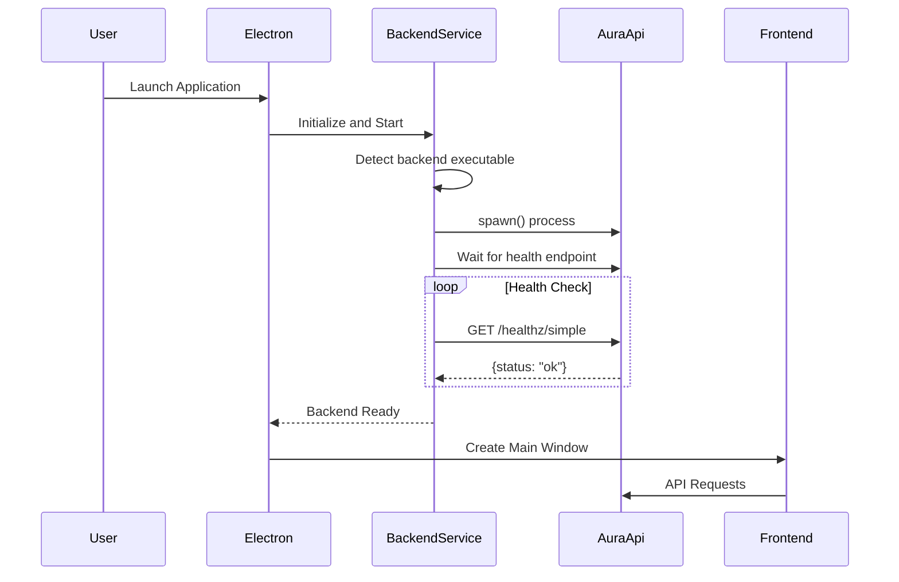
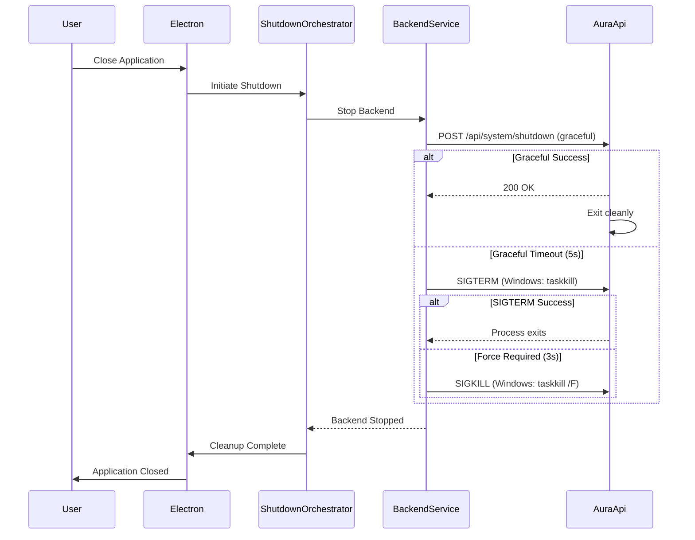

# Backend Auto-Start Architecture

## Overview

Aura Video Studio automatically manages the .NET backend (Aura.Api) lifecycle when running as an Electron desktop application. Users never need to manually run `dotnet run --project Aura.Api`. This document explains how the auto-start system works.

## Architecture

### Components

1. **Electron Main Process** (`Aura.Desktop/electron/main.js`)
   - Application entry point
   - Orchestrates all modules including backend service
   - Handles startup sequence and error recovery

2. **Backend Service** (`Aura.Desktop/electron/backend-service.js`)
   - Manages .NET backend process lifecycle
   - Spawns backend executable or uses `dotnet run` in development
   - Monitors health and handles restarts
   - Ensures clean shutdown

3. **Safe Initialization** (`Aura.Desktop/electron/safe-initialization.js`)
   - Provides wrapped initialization with error handling
   - Manages backend startup timeout (60 seconds)
   - Implements degraded mode fallbacks

4. **Process Manager** (`Aura.Desktop/electron/process-manager.js`)
   - Centralized process tracking
   - Monitors all child processes including backend
   - Ensures no zombie processes

5. **Shutdown Orchestrator** (`Aura.Desktop/electron/shutdown-orchestrator.js`)
   - Coordinates graceful shutdown
   - Stops backend before app exit
   - Cleans up temporary files

### Startup Sequence



### Backend Detection

The BackendService automatically detects the backend executable in this priority order:

1. **Production Build** (Installed/Portable)
   - `resources/backend/win-x64/Aura.Api.exe`
   - `resources/backend/Aura.Api.exe`

2. **Development Build**
   - `Aura.Api/bin/Release/net8.0/win-x64/Aura.Api.exe`
   - `Aura.Api/bin/Debug/net8.0/Aura.Api.exe`

3. **Fallback to .NET CLI**
   - Uses `dotnet run --project Aura.Api` if executable not found
   - Requires .NET 8 SDK installed

### Health Checking

#### Backend Endpoints

The backend provides multiple health endpoints:

- **`/healthz/simple`** - Lightweight check (no dependencies)
  - Returns `{status: "ok"}` immediately
  - Used by Electron for startup detection
  
- **`/api/health/live`** - Liveness check
  - Verifies HTTP server is responding
  - Used for basic health monitoring

- **`/api/health/ready`** - Readiness check
  - Verifies all dependencies are ready (database, providers, etc.)
  - Returns 503 if unhealthy, 200 if ready
  - Used before processing requests

#### Frontend Health Service

The frontend (`Aura.Web/src/services/backendHealthService.ts`) provides:

- **Retry Logic**: Exponential backoff with configurable retries
- **Timeout Handling**: Graceful degradation on timeout
- **Status Caching**: Reduces unnecessary health checks
- **Wait for Ready**: Polls until backend becomes healthy

Example usage:

```typescript
import { backendHealthService } from '@/services/backendHealthService';

// Quick check
const status = await backendHealthService.quickCheck();

// Wait for backend (useful during startup)
const isHealthy = await backendHealthService.waitForHealthy(30000); // 30s timeout

// Check with retries
const status = await backendHealthService.checkHealth({
  timeout: 5000,
  maxRetries: 10,
  retryDelay: 1000,
  exponentialBackoff: true,
});
```

### Backend Status Banner

The `BackendStatusBanner` component (`Aura.Web/src/components/Onboarding/BackendStatusBanner.tsx`) provides user-facing status:

1. **Loading State**: Shows "Starting Backend Server..." on initial load
2. **Auto-Retry**: Automatically retries for 15 seconds during startup
3. **Waiting State**: Shows retry progress while backend is starting
4. **Error State**: Shows error only after retries exhausted
5. **Success State**: Banner disappears when backend is healthy

### Shutdown Sequence



## Development vs Production

### Development Mode

When running `npm run dev` in Aura.Desktop:

- Backend starts via `dotnet run --project Aura.Api`
- Environment set to `Development`
- Hot reload NOT supported (backend must restart manually if code changes)
- Logs to console and file

### Production Mode

When running installed application:

- Backend runs from compiled executable
- Environment set to `Production`
- Self-contained (no .NET SDK required)
- Logs to file only

## Configuration

### Environment Variables

The backend respects these environment variables (set by Electron):

```bash
ASPNETCORE_URLS=http://localhost:5005      # Listening URL and port
ASPNETCORE_ENVIRONMENT=Production          # Environment (Development/Production)
DOTNET_CLI_TELEMETRY_OPTOUT=1             # Disable .NET telemetry
AURA_DATA_ROOT=/path/to/data              # Data directory
AURA_TEMP_ROOT=/path/to/temp              # Temp directory
AURA_FFMPEG_PATH=/path/to/ffmpeg          # FFmpeg executable path
```

### Network Contract

The backend contract is resolved via `network-contract.js`:

```javascript
{
  baseUrl: "http://localhost:5005",
  port: 5005,
  shouldSelfHost: true,              // Electron manages process
  healthEndpoint: "/health/live",
  readinessEndpoint: "/health/ready",
  maxStartupMs: 60000,               // 60 second timeout
  pollIntervalMs: 1000               // Check every 1 second
}
```

## Troubleshooting

### Backend Fails to Start

**Symptoms**: "Backend Server Not Reachable" error persists after 15 seconds

**Possible Causes**:
1. .NET 8 runtime not installed (production) or SDK not installed (development)
2. Port 5005 already in use by another application
3. Firewall blocking the backend process
4. Backend executable missing or corrupted
5. Backend crashes on startup

**Resolution**:
1. Check application logs: `%LOCALAPPDATA%/Aura/logs/`
2. Verify .NET installed: `dotnet --version` (should show 8.0.x)
3. Check port availability: `netstat -ano | findstr :5005`
4. Run backend manually to see errors: `cd Aura.Api && dotnet run`
5. Check Windows Event Viewer for .NET errors

### Backend Starts but Frontend Can't Connect

**Symptoms**: Backend console shows "Application started" but frontend shows error

**Possible Causes**:
1. Firewall blocking localhost connections
2. Antivirus blocking the application
3. Incorrect VITE_API_BASE_URL in frontend config
4. CORS configuration issue

**Resolution**:
1. Verify backend is listening: Visit `http://localhost:5005/healthz/simple` in browser
2. Check frontend config: `VITE_API_BASE_URL` in `.env.local`
3. Disable antivirus temporarily to test
4. Check browser console for CORS errors

### Zombie Backend Processes

**Symptoms**: Backend process remains running after closing application

**Possible Causes**:
1. Shutdown timeout too short
2. Process manager failed to track process
3. Backend unresponsive to signals

**Resolution**:
1. Check shutdown logs in application logs
2. Manually kill process: `taskkill /F /IM Aura.Api.exe`
3. Restart computer if process is stuck
4. Report issue on GitHub with logs

## Testing

### Manual Testing

1. **Clean Start Test**:
   ```bash
   # Kill any existing backend processes
   taskkill /F /IM Aura.Api.exe
   
   # Start Electron app
   cd Aura.Desktop
   npm start
   
   # Verify backend auto-starts (check task manager)
   # Frontend should connect within 5 seconds
   ```

2. **Restart Test**:
   - Start application
   - Verify backend running
   - Close application
   - Verify backend stopped (check task manager)
   - Start application again
   - Verify no errors

3. **Crash Recovery Test**:
   - Start application
   - Kill backend process manually: `taskkill /F /IM Aura.Api.exe`
   - Wait for health check failure
   - Restart application
   - Verify backend starts successfully

### Automated Tests

Located in `Aura.Desktop/test/`:

- `test-electron-backend-integration.js` - Integration tests
- `test-process-manager.js` - Process tracking tests
- `test-shutdown-orchestrator.js` - Shutdown tests

Run tests:
```bash
cd Aura.Desktop
npm test
```

## Future Improvements

Potential enhancements to the auto-start system:

1. **Multi-instance Detection**: Prevent multiple instances from starting conflicting backends
2. **Port Auto-Selection**: Automatically choose available port if 5005 is busy
3. **Backend Health Dashboard**: Real-time monitoring in UI
4. **Automatic Restart**: Auto-restart backend if it crashes during operation
5. **External Backend Support**: Connect to existing backend instance instead of spawning
6. **Backend Update Management**: Seamless backend updates without restart

## Related Documentation

- [Installation Guide](../../INSTALLATION.md)
- [Development Guide](../../DEVELOPMENT.md)
- [Troubleshooting](../../TROUBLESHOOTING.md)
- [Backend API Documentation](../api/README.md)

## References

- Backend Service Implementation: `Aura.Desktop/electron/backend-service.js`
- Electron Main Process: `Aura.Desktop/electron/main.js`
- Frontend Health Service: `Aura.Web/src/services/backendHealthService.ts`
- Backend Health Endpoints: `Aura.Api/Program.cs` (lines 2500-2568, 5323-5331)
